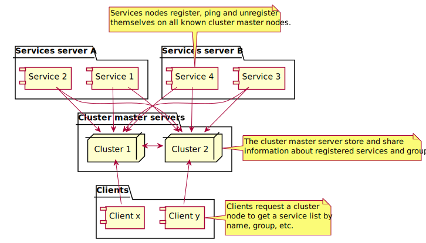

QWAZR Cluster
=============

Cluster Service for [QWAZR](https://www.qwazr.com).

A centralized service for distributed systems which collect and provide information about services.

It exposes a JSON Web service API that let any service registering and unregistering itself.
The registered services can be grouped.

Cluster service can be used as a
- A standalone JSON Web service,
- Embedded in a JAVA application.

Open source
-----------
The source code of the project is hosted at
[github/qwazr/cluster](https://github.com/qwazr/cluster).

As a QWAZR component it is released under the
[Apache 2 license](https://www.apache.org/licenses/LICENSE-2.0).