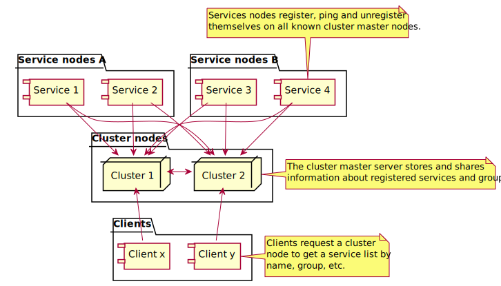

QWAZR Cluster
=============

A centralized service for distributed systems which collect and provide information
about services and group of services.

The purpose of QWAZR cluster is to provide a simple and safe way to expose a set of services to a set of clients. 

The general principle is simple:
- Any **services** can register itself to the **cluster** by using datagram messages.
- The **clients** request the **Cluster** to obtain the **endpoints** of existing services.
- The **clients** can then contact the **services** by using the provided **endpoints**.

_The cluster master servers do not know anything about how to contact a service.
Neither do them acts as a proxy or a load balancer. It is up to the client to know how to work
with the provided endpoints._

The QWAZR Cluster service can be used in two different ways:
- **Standalone JSON Web service :**
It exposes a JSON Web service API that let any service registering and unregistering itself.
- **Embedded in a JAVA application :**
The library manages the network connections and provide a JAVA service which let you request the cluster information.

How does it work?
-----------------

{:class="img-fluid"}

### Actor list

Here are the typical actors of the system.

### Service instance
 
A service instance is any arbitrary service running on a server that wants to be visible on the cluster.

It is defined by:
- **A generic service name :** This name describe the kind of service provided by the instance.
- **A group list :**  the groups this service belongs.
- **A public endpoint**: The hostname name and the port this service can be contacted with by the clients.

A service will register itself to the cluster nodes.

### Cluster node

An instance of QWAZR Cluster (Cluster Manager) which is in charge of sharing information about available services.

Several cluster nodes share information.
Each instance are then synchronized and will provide the same information.

### Cluster Client

A cluster client is any program that want to get information about existing services and their locations.
The client can then use the information provided by the cluster request and contact directly the service.

### Network communication design

There is two different network designs. One is base on [multicast](https://en.wikipedia.org/wiki/Multicast),
the other one is based on **master nodes**. The communication are always transported using the
[datagram protocol](https://en.wikipedia.org/wiki/User_Datagram_Protocol).

#### Using multicast

The cluster nodes automatically detect themselves and share information about the services
by broadcasting to a multicast address.

{:class="img-fluid"}

#### Using master nodes
 
The cluster nodes register themselves to a set of master nodes by using an existing list declared in the configuration. 
