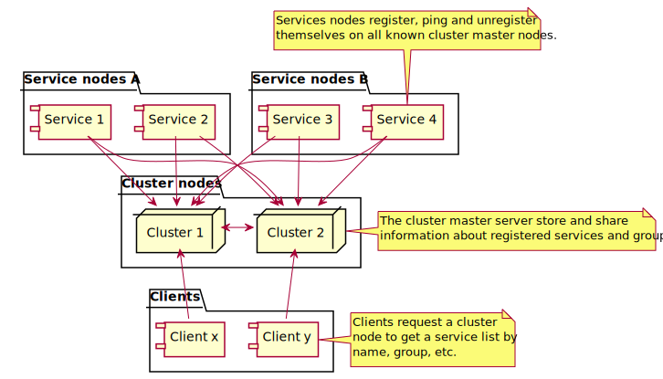

QWAZR Cluster
=============

**Qwazr Cluster** est un service pour système distribué dont le rôle est la collecte, le maintien, et la mise à
disposition des informations concernant les services présents dans le cluster.

The purpose of QWAZR cluster is to provide a simple and safe way to expose a set of services to a set of clients. 

Voici les principes généraux:
- Les **services** s'enregistrent sur le **cluster** au travers de messages UDP (Datagram).
- Le **cluster** partage ces informations avec l'ensemble des **services** membres du cluster.
- Les **clients** interrogent le **Cluster** pour obtenir les **points d'entrée** des **services** membres.
- Les **clients** peuvent alors contacter les **services** en utilisant les **points d'entrée** récoltés.

_Attention! Le cluster ne connait rien des services membre, et ne sais pas comment les contacter.
Il n'agit pas non plus en tant que proxy ou répartiteur de charge. C'est au client de savoir comment procéder avec
les points d'entrée renvoyés._

Un service QWAZR Cluster peut être utilisé de deux façons différentes:
- **En tant que web service JSON autonome :**
Dans ce cas, il expose un jeu d'API sous la forme d'un webservice JSON qui permet d'interroger le statut du cluster.
- **Embarqué dans une application JAVA :**
La librarie prend en charge les connections reseaux (UDP) au travers d'un composant nommé ClusterManager
qui fournit également un service d'interrogation en JAVA.

Comment cela fonctionne t-il?
-----------------------------

Voici un schema de principe général.

{:class="img-fluid"}

### Liste des acteurs

#### Service
 
Un service est typiquement une instance de programme JAVA qui s'enregistre sur le cluster
en utilisant la librarie QWAZR Cluster.

Un service est défini par:
- **Un nom de service générique :** This name describe the kind of service provided by the instance.
- **La liste des groupes :**  a quel groupe appartient le service (optionel).
- **Le point d'entrée**: Le couple nom d'hôte et port à partir duqle ce service peut être contacté.

#### Cluster node

Une instance de QWAZR Cluster (ClusterManager) en charge de partager les informations relatives aux services.
L'ensemble des instances ClusterManager échangent les informations concernant les service en utilisant
des messages UDP (Datagram).

#### Client

Un client du cluster est un programme qui interroge le cluster pour obtenir la liste des services disponible
et leur points d'entrée.
Le client peut alors utiliser ces informations pour contacter directement les services.

### Modèle de communication réseau

Il y a deux modèles de communication disponibles:
 
- Le premier est basé sur le protocole [multicast](https://en.wikipedia.org/wiki/Multicast).
Voir [Multicast-Cluster](multicast-cluster)
- l'autre est basé sur l'utilisation de **noeuds master** qui assurent la mise en relation.
Voir [Masters-cluster](masters-cluster)

La communication entre les noeuds s'appuie sur le protocole UDP
[datagram protocol](https://en.wikipedia.org/wiki/User_Datagram_Protocol).

Chaque instance de ClusterManager écoute sur un port déterminé dans la configuration (ServerConfiguration).

Open source
-----------
Le code source du projet est accessible ici
[github/qwazr/cluster](https://github.com/qwazr/cluster).

Comme tout composant QWAZR, il est publié sous license
[Apache 2 license](https://www.apache.org/licenses/LICENSE-2.0).
