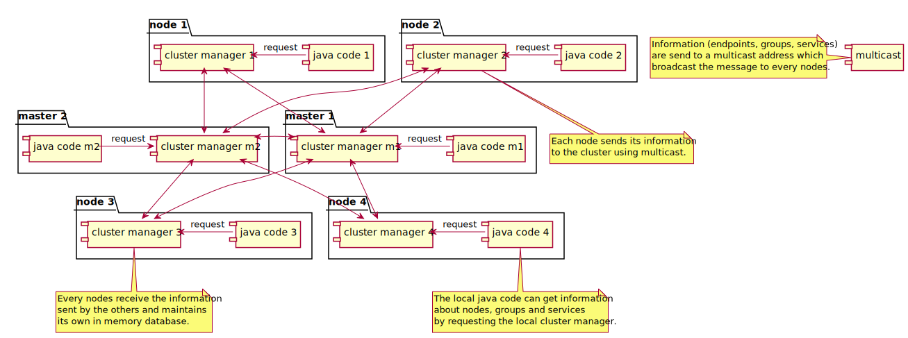
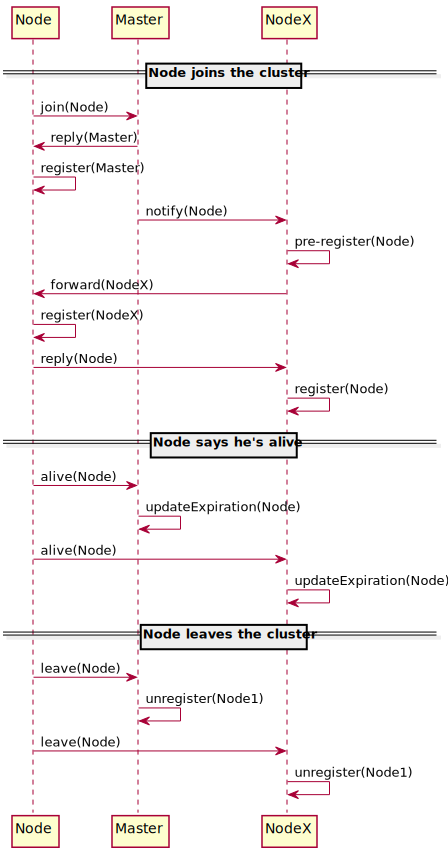

Cluster avec Masters
====================
 
Principe général
----------------

Les services s'enregistrent auprès de noeuds Masters, dont le rôle est de collecter et maintenant la liste des noeuds
présents dans le cluster et d'assurer la transmission des échanges entre le noeuds.

{:class="img-fluid"}

{:class="img-fluid"}
