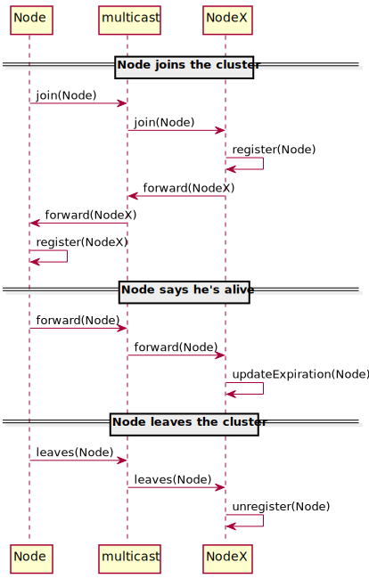

Multicast cluster
=================

The cluster nodes automatically detect themselves and share information about the services
by broadcasting to a multicast address.

{:class="img-fluid"}

{:class="img-fluid"}
